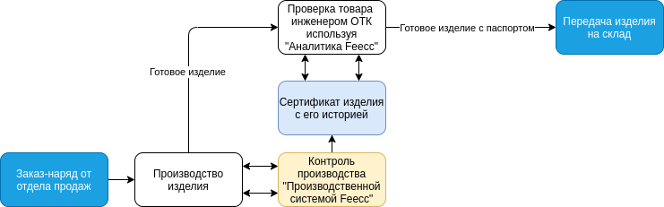

# Описание 

Платформа представляет из себя набор программного обеспечения для осуществления контроля за производственным процессом и
сбора информации для последующего анализа ОТК или другими участниками. Глобально схему интеграции платформы в бизнесс-процесс
можно представить так:

## Возможности платформы

#### Четкая связь сотрудника с продуктом

Feecc отслеживает все этапы рабочего процесса с помощью видеозаписи, регистрации данных с периферийных устройств и 
авторизации доступа сотрудников. Платформа поддерживает любой последовательный рабочий процесс, включая долгосрочные или
прерываемые операции.

#### Цифровой сертификат продукта

Все цифровые следы рабочего процесса сводятся в единый сертификат изделия с уникальным идентификатором, который затем 
прикрепляется в виде QR-кода к изделию. Feecc может добавлять в сертификат пользовательские параметры процесса и 
автоматизировать его создание даже для составных изделий.

#### Различные периферийные устройства

Feccc поддерживает стандартные цифровые интерфейсы ввода-вывода для подключения различных устройств 
(видеокамер, сканеров, принтеров и т. д.).

#### Защита распределенных технологий

Feecc использует безопасное хранилище данных на основе архитектуры с адресацией по содержимому и распределенного реестра,
чтобы гарантировать надежность и достоверность собранных данных рабочего процесса.

#### Гибкость
Системы с Feecc можно легко настроить под конкретный рабочий процесс с помощью необходимого оборудования. 
Команда разработчиков проведет вас через весь цикл настройки и интегрирует Feecc в ваш рабочий процесс.
