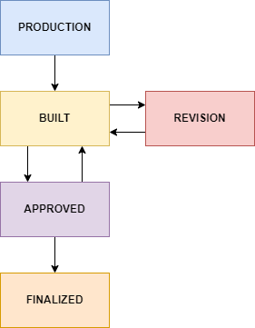
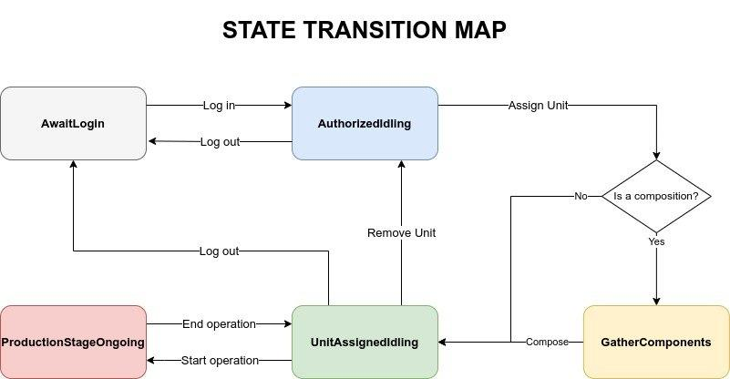

# Workbench Daemon
> "Feecc Workbench Daemon - это сердце системы контроля качества Feecc. Он устанавливается на клиентские устройства,
> расположенные на рабочих местах сотрудников, предоставляя пользователям доступ ко всем возможностям Feecc и гибкую
> систему конфигурации для быстрого начала работы."

## Стек технологий

- Операционная система - [GNU/LINUX](https://www.gnu.org/), рекомендуется [Ubuntu](https://ubuntu.com/)
- Язык программирования - [Python](https://www.python.org/)
- ASGI-сервер - [Uvicorn](https://www.uvicorn.org/)
- REST-запросы - [FastAPI](https://fastapi.tiangolo.com/)
- ПО для развертывания - [Docker](https://www.docker.com/)
- База данных - [MongoDB](https://www.mongodb.com/)

Необходимое оборудование для рабочего места инженера (далее - РМИ) перечислено в [соответствующей статье](./workbench-and-components.md).
Исходный код модуля доступен по [ссылке](https://github.com/Multi-Agent-io/feecc-workbench-daemon).

## Развертывание

Клонируйте репозиторий с GitHub с помощью команды `git clone`. Перейдите в папку репозитория и поменяйте файл
конфигурации `src/config/config.yaml` в соответствии со своими нуждами.

Установите [Docker](https://docs.docker.com/engine/install/) и [docker-compose](https://docs.docker.com/compose/install/).
Разверните Feecc Workbench Daemon при помощи Docker-compose: находясь в корне репозитория введите команду
`sudo docker-compose up -d --build`.

> Обратите внимание: опция `--build` говорит системе собрать образ контейнера перед запуском. В зависимости от
> скорости соединения и конфигурации машины этот процесс может быть достаточно долгим, однако нет необходимости
> повторять этот шаг перед каждым запуском. При последующем запуске эту опцию можно будет убрать, однако после
> каждого обновления или изменения конфигурации образ требуется собрать заново. Повторная сборка обычно происходит
> гораздо быстрее, т.к. использует кеш предыдущей сборки, если он не устарел.

После этого шага сервер должен быть доступен по адресу `127.0.0.1:5000`. Проверьте, запустились ли ваши контейнеры с
помощью менеджера процессов Docker: введите команду `sudo docker ps` и удостоверьтесь в том, что видите в списке
процессов контейнер `feecc_workbench_daemon`. Если это не так, вероятно возникли ошибки на этапе сборки и запуска.
Проверьте лог сборки, устраните их и повторите предыдущий шаг.

Если контейнер присутствует в таблице, попробуйте перейти в браузер и открыть страницу `http://127.0.0.1:5000/docs`, в
ней должна быть отражена документация по REST API серверу системы. Если страница по этому адресу недоступна, то сервер
не запустился должным образом. Следует проверить логи внутри контейнера на предмет ошибок, исправить их и повторить
сборку и запуск.

## Описание модуля

Этот модуль вкупе с [модулем фронтеда](./feecc-workbench-frontend.md) является основным ПО, обеспечивающим работу инженера на РМИ.
В основе работы сервера лежат три основных набора хендлеров: unit, workbench и employee. Остальные модули являются
вспомогательными, о них позже

> Более подробно об эндпоинтах, в частности, о форматах данных,  - в Swagger по адресу/порту сервера в `/docs`

### Роутер Employee. Сотрудник

Роутер [`employee`](гх линк на файл) отвечает за информацию и взаимодействие с **сотрудником**: логин, логаут, информация об
этапе сборки. Эндпоинты:

###### `POST` /info
> Получение всей информация о сотруднике на текущем РМИ

###### `POST` /log-in
> Логин сотрудника в систему на текущем РМИ

###### `POST` /log-out
> Логаут сотрудника

Идентификация работника происходит по его номеру пропуска с помощью RFID ридера. Момент с RFID ридером вариативен, это
может быть другой числовой идентификатор, даже логин пароль.

### Роутер Unit. Изделие

Роутер [`unit`](гх линк на файл) отвечает за информацию и взаимодействие с **изделием** на рабочем столе. Вместе с
[роутером `workbench`](#workbench) составляет основу логики работы демона. С помощью нижеперечисленных хендлеров
происходит создание новых объектов, изменение их состояний итд. Подробнее про схемы ниже. Для начала краткое
описание каждого хендлера:

###### `GET` /new
> Создается новое изделие. Аргументом является рабочая схема, которая является разной для разных типов продуктов.

###### `GET` /pending_revision`
> Получение списка изделий на ревизии.

###### `POST` /assign-component/{unit_internal_id}
> Добавить уже собранное изделие по его `unit_internal_id` как компонент
> текущего изделия.

###### `POST` /{unit_internal_id}/info
> Получение всей информации об изделиии: процессы, схемы, статус, история, компоненты итд.

Стоит отметить, что частью ссылки является `unit_internal_id` - 10-значный десятеричный номер, который вычисляется из `uid` -
32-значного шестнадцатеричного идентификатора, используемого в сертификате.

###### `POST` /upload
> Используется при выпуске сертификата. Выпускает сертификат, печатает qr-код, сохраняет данные в datalog
> Робономики. С появлением модуля ОТК утратил актуальность.


#### Информация об изделии в БД
Само изделие в БД имеет следующий вид:
```json
{
	"_id": {"$oid":"620110bd78fd637113bdde25"},
	"schema_id": "18df0754426a47b99e40233d4c038f26",
	"uuid": "ef9b0d57ba4c4c5bbf052ebe1cf32812",
	"internal_id": "3184905676274",
	"is_in_db": true,
	"passport_short_url": null,
	"passport_ipfs_cid": null,
	"components_internal_ids": [],
	"featured_in_int_id": null,
	"creation_time": {"$date":{"$numberLong":"1644236989735"}},
	"status": "status"
}
```

#### Статусы изделия.
У каждого изделия есть статус. Они меняются по схеме, представленной ниже:



Описание статусов представлено в таблице.

| Значение   | Описание                                                                                                                                                                                            |
|------------|-----------------------------------------------------------------------------------------------------------------------------------------------------------------------------------------------------|
| production | Присваивается изделию при инициализации. Изделие находится в процессе производства. Предписанные схемой этапы не пройдены до конца. По окончании прохождения этапов изделие получит статус “built”. |
| built      | Производство изделия завершено. Все предписанные производственной схемой этапы пройдены как минимум один раз. Ожидает прохождения технического контроля.                                            |
| revision   | Отдел технического контроля отправил изделие на доработку и создал новые предписанные для прохождения этапы. По прохождении этих этапов изделие получит статус “built”.                             |
| approved   | Выпущено отделом ОТК.                                                                                                                                                                               |
| finalized  | Собранное изделие, прошедшее отдел технического контроля и выпущенное в продажу.                                                                                                                    |

Статус изделия нельзя изменить напрямую запросом на эндпоинт, статус меняется во время процесса сборки.

### Роутер Workbench. Рабочее место инженера

Роутер отвечает за один **рабочий стол**, на котором работает демон, те. на котором стоит один клиентский компьютер.
Хранит состояния стола, информацию о нем. Вместе с [роутером `unit`](#unit) составляет основу логики работы демона.

###### `GET` /status
> Получение информации о статусе рабочего стола: статус, сотрудник, изделие, биография, итд.

###### `GET` /production-schemas/names
> Получить все схемы продуктов.

###### `GET` /production-schemas/{schema_id}
> Получить информацию о схеме по ее id.

###### `POST` /assign-unit/{unit_internal_id}
> Добавить изделие на сборку на данное РМИ. Подробнее про `unit_internal_id` в [`unit`](#unit).

###### `POST` /end-operation
> Закончить запись процесса сборки юнита.
###### `POST` /hid-event
> Обработка информацици с [HID-ридера](./feecc-hid-reader-daemon.md).

###### `POST` /remove-unit
> Удалить юнит с рабочего стола.

###### `POST` /start-operation
> Начать запись процесса сборки юнита.


#### Статусы РМИ.

Объект рабочего места работает как конечный автомат и имеет состояния, представленные на изображении.



Описание статусов представлено в таблице.

| Значение               | Описание                                                                                                                                                                                                                                        |
|------------------------|-------------------------------------------------------------------------------------------------------------------------------------------------------------------------------------------------------------------------------------------------|
| AwaitLogin             | Начальное состояние РМИ. Ждет авторизации инженера посредством RFID. При логине происходит валидация данных и проводится проверка того, что такой сотрудник существует.                                                                         |
| AuthorizedIdling       | Состояние РМИ после авторизации инженера. Простаивает до логаута сотрудника или помещения юнита на стол (посредством сканирования штрих-кодов).                                                                                                 |
| GatherComponents       | Состояние присваивается РМИ, если юнит на нем является сборкой из других компонентов. Все сканирования штрих-кодов ведут к попытке добавления компонентов к изделию с проверкой законченности сборки компонента и его принадлежности к изделию. |
| UnitAssignedIdling     | Состояние ожидания начала сборки. Рабочий залогинен, юнит на столе. Разлогиниться из UnitAssignedIdlind - то же самое, что сначала удалить юнит, а потом произвести логаут.                                                                     |
| ProductionStageOngoing | Процесс сборки изделия на столе, идет видеозапись.                                                                                                                                                                                              |

### Дополнительные функции

Остальные скрипты несут функцию дополнительных модулей.

| Функция                    | Описание                                                                                                                                                                                                                                               |
|----------------------------|--------------------------------------------------------------------------------------------------------------------------------------------------------------------------------------------------------------------------------------------------------|
| `Camera.py`                | Осуществляет проверку наличия камеры и отправку запросов на [Cameraman](./feecc-cameraman.md) на начало и остановку записи процесса сборки.                                                                                                            |
| `Employee.py`              | Осуществляет хранение данных о сотруднике в захешированном виде.                                                                                                                                                                                       |
| `IO_gateway.py`            | Осуществляет коммуникацию с хабом на предмет запросов на [печать qr-кодов](./feecc-print-server.md), запросов на [загрузку файлов в IPFS](./feecc-ipfs-gateway.md), отправку данных в [datalog](https://wiki.robonomics.network/docs/en/rio-datalog/). |
| `ProductionStage.py`       | Класс для хранения данных о сборке на РМИ.                                                                                                                                                                                                             |
| `Singleton.py`             | Отвечает за то, что в любой момент времени только один инстанс конкретного класса доступен публично.                                                                                                                                                   |
| `Types.py`                 | Определяет комплексные типизации.                                                                                                                                                                                                                      |
| `Unit.py`                  | осуществляет обработку запросов к роутеру [`unit`](#unit).                                                                                                                                                                                             |
| `WorkBench.py`             | Осуществляет обработку запросов к роутеру [`workbench`](#workbench).                                                                                                                                                                                   |
| `_Barcode.py`              | Сохраняет штрих-код изделия.                                                                                                                                                                                                                           |
| `__init__.py`              | Файл инициализации.                                                                                                                                                                                                                                    |
| `_db_utils.py`             | Утилиты для общего взаимодействия с MongoDB.                                                                                                                                                                                                           |
| `_image_generation.py`     | Создание qr-кодов и наклеек "опломбировано.                                                                                                                                                                                                            |
| `_short_url_generation.py` | Создание и обновление коротких ссылок [YOURLS](https://yourls.org/).                                                                                                                                                                                   |
| `config.py`                | Загрузка конфига.                                                                                                                                                                                                                                      |
| `database.py`              | Конкретные функции для взаимодействия с базой данных.                                                                                                                                                                                                  |
| `exceptions.py`            | Определение исключений.                                                                                                                                                                                                                                |
| `models.py`                | Определение свойств различных классов, используемых в демоне.                                                                                                                                                                                          |
| `passport_generation.py`   | Формирование сертификата для дальнейшей загрузки в IPFS.                                                                                                                                                                                               |
| `states.py`                | Класс состояний [workbench](#_6).                                                                                                                                                                                                                      |
| `unit_utils.py`            | Утилиты для создания биографии юнита (изделия).                                                                                                                                                                                                        |
| `utils.py`                 | Декоратор времени выполнения операции, валидация сканера штрих-кодов, генерация тайм-стемпа.                                                                                                                                                           |
