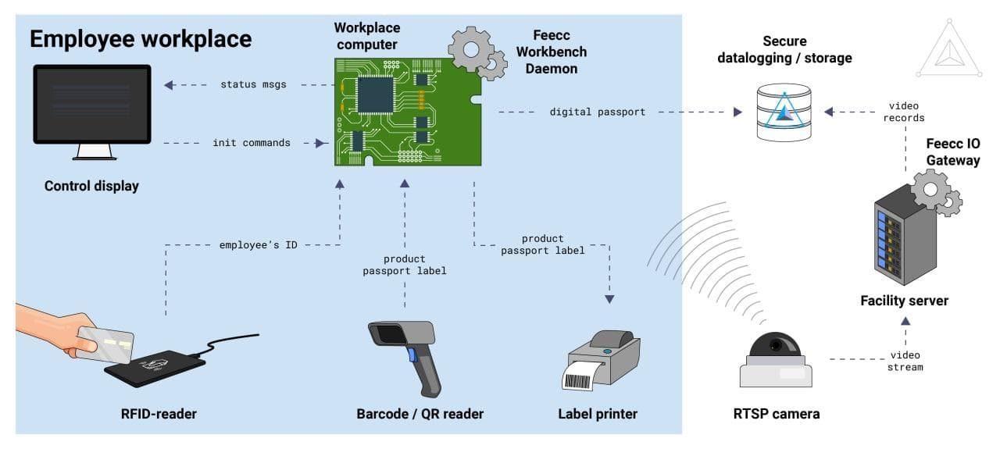

# FEECC

> *Feecc* — это платформа, разработанная [Multi-Agent Systems](https://multi-agent.io/), позволяющая предприятиям 
> создавать и настраивать собственные системы контроля качества продуктов или услуг в соответствии со своими потребностями.

С помощью технологий web3 и набора гибких программных модулей Feecc позволяет проводить аудит доступа сотрудников к
рабочему месту и извлекать все данные о рабочих процессах. Информация хранится в неизменном и безопасном хранилище с 
простым доступом для отдела контроля качества.
Благодаря Feecc предприятие может не только оцифровать свои процессы и избавиться от надоедливой бюрократии и судебных 
исков, но и привлечь внимание новых потребителей к продукту, повысив доверие к нему.

Узнать больше про [платформу](customer/description.md), [продукты](customer/products.md), [требуемое оборудование](customer/equipment.md)
и существующие [кейсы](customer/cases.md) можно в разделе **Customer**.

В разделе **Developer** более детально описываются все модули, которые составляют основу платформы. Во [введении](developer/introduction.md)
приводится подробное описание каждой страницы раздела.